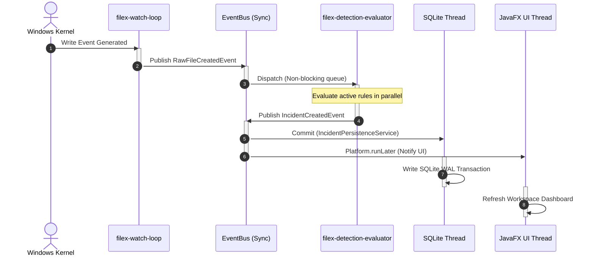

# <p align="center"><br>FileX — Enterprise Endpoint Telemetry & Threat Detection Agent</p>

<p align="center">
  
  
  
  
  
</p>

---

**FileX** is a production-grade, highly optimized local security agent designed to monitor host filesystem operations at the OS API layer, analyze telemetry in real-time using parallel heuristics, and persist security incidents inside a relational forensic archive.

Built on Java 21, JavaFX, and an asynchronous event-driven architecture, FileX stands out with zero global singleton abuse, clean constructor dependency injection, strict thread boundary isolation, and a premium SaaS-grade threat briefing workspace.

---

## 📚 Technical Documentation Index

Explore our comprehensive technical blueprints, developer setup guides, and contributor standards:

*   **[🏗️ Architecture Blueprint](docs/architecture.md)** — Clean design layers, type-safe event buses, and bootstrapping.
*   **[🛡️ Threat Heuristics Guide](docs/threat_detection.md)** — In-depth analysis of built-in security rules (Ransomware modify bursts, hidden dotfiles).
*   **[🛡️ Security & Trust Model](docs/security_model.md)** — Agent security context, trust boundaries, and OS access control.
*   **[🛠️ Developer Setup Guide](docs/development_setup.md)** — Local compile requirements, custom sandbox path resolutions, and IDE configurations.
*   **[🧪 Testing & Verification Guide](docs/testing_guide.md)** — Core unit tests, integration paths, and concurrency limits.
*   **[📊 Observability & Diagnostics](docs/observability.md)** — Structured key-value logging standards, MDC context propagation, and rolling file logs.
*   **[🔍 Operational Troubleshooting](docs/troubleshooting.md)** — Diagnosing directory permissions, UI lags, and SQLite WAL write-waits.
*   **[⚠️ Known Limitations](docs/known_limitations.md)** — In-memory backpressure, OS watch limits, and the product roadmap.

---

## 🏗️ Premium System Architecture

FileX utilizes a highly decoupled, reactive architectural pipeline. Below is the end-to-end telemetry workflow detailing how a physical filesystem event on the operating system transitions into a persistent threat record inside the operator's workspace UI:


---

## ⚡ Concurrency & Thread Isolation Model

To maintain ultra-low overhead and guarantee that local monitoring never starves the operator dashboard or bottlenecks the operating system, FileX enforces a strict thread-boundary model:

*   **`filex-watch-loop` (Daemon):** Locks onto OS-native filesystem blocking hooks. It captures, normalizes, and exits the telemetry cycle within microseconds.
*   **`filex-detection-evaluator` (Executor Pool):** Dedicated worker thread pool handling parallel matching heuristics. Evaluation scales dynamically without ever blocking directory events.
*   **`JavaFX Application Thread`:** Purely handles workspace UI rendering and FXML lazy caching. Avoids lag during bulk telemetry processing.



---

## 🛡️ Active Threat Protection Rules

FileX is equipped with five out-of-the-box, production-grade telemetry rules that run concurrently against system events:

| Threat Rule | Objective | Behavioral Heuristic Pattern | Severity |
| :--- | :--- | :--- | :--- |
| **`MassDeletionRule`** | Anti-Ransomware / Data Destruction | Checks if more than `N` files are deleted in a folder within a 5-second sliding window. | **HIGH** |
| **`RapidModificationRule`** | Mass Encryption / Data Locking | Detects quick, consecutive modifications to the same file or a high frequency of modifications across folders within a sliding temporal window. | **HIGH** |
| **`SuspiciousExtensionRenameRule`** | Masquerading / Double Extension | Flags attempts to disguise files or hide payloads (e.g., naming a file `invoice.pdf.exe`). | **MEDIUM** |
| **`HiddenFileCreationRule`** | Hidden Persistence Setup | Flags files created with OS hidden attributes or starting with leading dots in user spaces. | **MEDIUM** |
| **`SensitiveDirectoryActivityRule`** | System Path Compromise | Triggers immediate alerts upon write attempts in crucial system paths (e.g., `System32`, `etc`, `AppData`). | **CRITICAL** |

---

## 🚀 Installation & Execution

### Prerequisites
*   **Java Development Kit (JDK 21 or later)**
*   PowerShell or Bash terminal

### 1. Build the Project
```bash
./gradlew build
```

### 2. Run the Application

#### A. Standard Sandbox Mode (Monitors current sandbox folders)
```bash
./gradlew run
```

#### B. Enterprise Production Mode (Focuses monitoring on specific host directories)
Supply monitored directory target lists directly through JVM system flags:
```powershell
.\gradlew.bat "-Dfilex.monitor.paths=C:\Users\ACER\Downloads,C:\Users\ACER\Documents" run
```

---

## 🧩 Developer Extension Guide: Writing Custom Rules

FileX's dynamic architecture allows you to easily plug in new rules at runtime without modifying the core detection pipeline. Simply implement the `DetectionRule` interface and register it with the `DetectionEngine`.

### Custom Rule Template:

```java
package com.filex.detection.rules;

import com.filex.detection.*;

public final class MalwareNameRule implements DetectionRule {

    @Override
    public String name() {
        return "MalwareFileNameDetection";
    }

    @Override
    public String description() {
        return "Detects files containing malicious signatures in their filenames";
    }

    @Override
    public boolean isEnabled() {
        return true;
    }

    @Override
    public DetectionResult evaluate(MonitoringEvent event, DetectionContext context) {
        if (event.path() != null) {
            String filename = event.path().getFileName().toString().toLowerCase();
            if (filename.contains("malware") || filename.contains("ransomware")) {
                return DetectionResult.matched("File name matches dangerous threat signature.");
            }
        }
        return DetectionResult.notMatched();
    }
}
```

### Registration at Boot:
```java
// Register directly via the public API of the DetectionEngine
appContext.detectionEngine().registerRule(new MalwareNameRule());
```

---

## 🤝 Contributing, Support, & Code of Conduct

* **[🤝 Contribution Standards](CONTRIBUTING.md)** — Pull request guidelines, conventional commits, and branching frameworks.
* **[📜 Code of Conduct](CODE_OF_CONDUCT.md)** — Project empathy pledges and professional community guidelines.
* **[🏛️ Project Governance](GOVERNANCE.md)** — Decision-making policies, committees, and maintainership promotions.
* **[🛡️ Security Vulnerability Reporting](SECURITY.md)** — Confidential reporting guidelines and security SLAs.

---

## 📜 Licensing & Authors

*   **Author:** TSR0705
*   **License:** Proprietary — All Rights Reserved.
