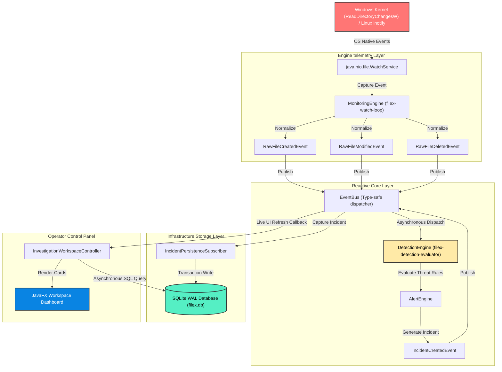
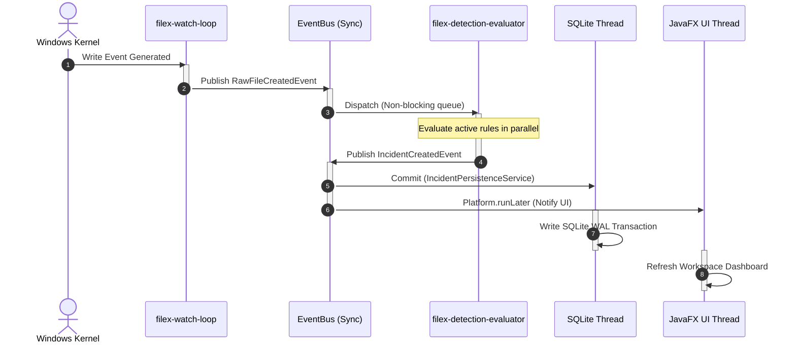
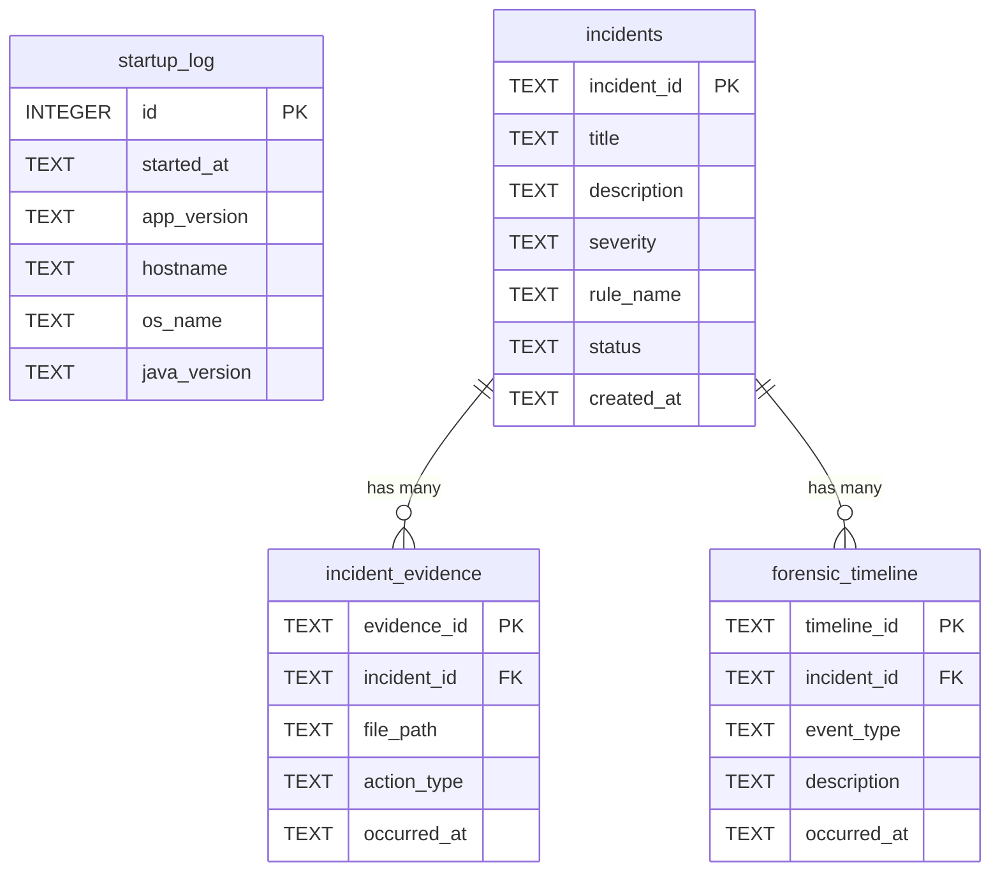

# <p align="center"><br>FileX — Enterprise Endpoint Telemetry & Threat Detection Agent</p>

<p align="center">
  
  
  
  
  
</p>

---

**FileX** is a production-grade, highly optimized local security agent designed to monitor filesystem operations at the OS kernel level, analyze telemetry in real-time using parallel heuristics, and persist security incidents inside a relational forensic archive. 

Built on Java 21, JavaFX, and an asynchronous event-driven architecture, FileX stands out with zero global singleton abuse, clean dependency injection, strict thread boundary isolation, and dynamic rule expandability.

---

## 📚 Extensive Technical Documentation

Explore the comprehensive sub-guides detailing specific system architectures, database designs, and investigator runbooks:

*   **[🏗️ Architecture Guide](file:///c:/Users/ACER/OneDrive/Desktop/FILE-X-REIMAGINE/docs/architecture.md)** — In-depth look at clean design layers, type-safe `EventBus` structures, and constructor-based dependency injection.
*   **[🛡️ Threat Detection Heuristics](file:///c:/Users/ACER/OneDrive/Desktop/FILE-X-REIMAGINE/docs/threat_detection.md)** — Analysis of all built-in security rules (Mass Deletion, Rapid Modifications, and Hidden persistence hooks).
*   **[🗄️ Database & Forensics Schema](file:///c:/Users/ACER/OneDrive/Desktop/FILE-X-REIMAGINE/docs/database_forensics.md)** — Comprehensive review of SQLite WAL database structures, versioned schema migrations, indexes, and database schemas.
*   **[💻 Operator & Investigation Manual](file:///c:/Users/ACER/OneDrive/Desktop/FILE-X-REIMAGINE/docs/operator_manual.md)** — Walkthrough of the FXML JavaFX workspace, alert master lists, and active filesystem telemetry testing.

---

## 🏗️ Premium System Architecture

FileX utilizes a highly decoupled, reactive architectural pipeline. Below is the end-to-end telemetry workflow detailing how a physical filesystem event on the operating system transitions into a persistent threat record inside the operator's workspace UI:



---

## ⚡ Concurrency & Thread Isolation Model

To maintain ultra-low overhead and guarantee that local monitoring never starves the operator dashboard or bottlenecks the operating system, FileX enforces a strict thread-boundary model:

*   **`filex-watch-loop` (Daemon):** Locks onto OS-native filesystem blocking hooks. It captures, normalizes, and exits the telemetry cycle within microseconds.
*   **`filex-detection-evaluator` (Executor Pool):** Dedicated worker thread pool handling parallel matching heuristics. Evaluation scales dynamically without ever blocking directory events.
*   **`JavaFX Application Thread`:** Purely handles workspace UI rendering and FXML lazy caching. Avoids lag during bulk telemetry processing.



---

## 🛡️ Active Threat Protection Rules

FileX is equipped with five out-of-the-box, production-grade telemetry rules that run concurrently against system events:

| Threat Rule | Objective | Behavioral Heuristic Pattern | Severity |
| :--- | :--- | :--- | :--- |
| **`MassDeletionRule`** | Anti-Ransomware / Data Destruction | Checks if more than `N` files are deleted in a folder within a 5-second sliding window. | **HIGH** |
| **`RapidModificationRule`** | Mass Encryption / Data Locking | Detects quick, consecutive modifications to the same file or a high frequency of modifications across folders within a sliding temporal window. | **HIGH** |
| **`SuspiciousExtensionRenameRule`** | Masquerading / Double Extension | Flags attempts to disguise files or hide payloads (e.g., naming a file `invoice.pdf.exe`). | **MEDIUM** |
| **`HiddenFileCreationRule`** | Hidden Persistence Setup | Flags files created with OS hidden attributes or starting with leading dots in user spaces. | **MEDIUM** |
| **`SensitiveDirectoryActivityRule`** | System Path Compromise | Triggers immediate alerts upon write attempts in crucial system paths (e.g., `System32`, `etc`, `AppData`). | **CRITICAL** |

---

## 📂 Forensic Persistence Schema

All security incidents, telemetry logs, and forensic timelines are maintained in a secure, relational database running SQLite in **WAL (Write-Ahead Logging)** mode with foreign keys enabled.

### Database Tables and Columns



---

## 🚀 Installation & Execution

### Prerequisites
*   **Java Development Kit (JDK 21 or later)**
*   PowerShell or Bash terminal

### 1. Build the Project
```bash
./gradlew build
```

### 2. Run the Application

#### A. Standard Mode (Default current working directory monitoring)
```bash
./gradlew run
```

#### B. Enterprise Production Mode (Custom directories monitoring)
Provide custom system properties to focus the monitoring engine on specific threat spaces (like your `Downloads` and `Documents` folders). Ensure you wrap properties in double quotes inside PowerShell:

```powershell
.\gradlew.bat "-Dfilex.monitor.paths=C:\Users\ACER\Downloads,C:\Users\ACER\Documents" run
```

---

## 🧩 Developer Extension Guide: Writing Custom Rules

FileX's dynamic architecture allows you to easily plug in new rules at runtime without modifying the core detection pipeline. Simply implement the `DetectionRule` interface and register it with the `DetectionEngine`.

### Custom Rule Template:

```java
package com.filex.detection.rules;

import com.filex.detection.*;

public final class MalwareNameRule implements DetectionRule {
    
    @Override
    public String name() {
        return "MalwareFileNameDetection";
    }

    @Override
    public String description() {
        return "Detects files containing malicious signatures in their filenames";
    }

    @Override
    public boolean isEnabled() {
        return true;
    }

    @Override
    public DetectionResult evaluate(MonitoringEvent event, DetectionContext context) {
        if (event.path() != null) {
            String filename = event.path().getFileName().toString().toLowerCase();
            // Flag files containing malicious threat names
            if (filename.contains("malware") || filename.contains("ransomware")) {
                return DetectionResult.matched("File name matches dangerous threat signature.");
            }
        }
        return DetectionResult.notMatched();
    }
}
```

### Registration at Boot:
```java
// Register directly via the public API of the DetectionEngine
appContext.detectionEngine().registerRule(new MalwareNameRule());
```

---

## 📂 Project Directory Structure

```
FileX/
├── src/main/java/com/filex/
│   ├── app/              # Bootstrap lifecycle, root container (AppContext)
│   ├── config/           # OS-aware path resolutions, AppConfig
│   ├── controller/       # Thin JavaFX Controllers (pure presentation)
│   ├── database/         # SQLite transaction manager, migrations DDL
│   ├── detection/        # Parallel evaluation engine & behavioral rules
│   ├── engine/           # Native OS WatchService monitor loop
│   ├── event/            # Decoupled EventBus and thread-safe events
│   ├── persistence/      # Incident persistence services
│   ├── ui/               # Lazy-loaded, cached view navigation (ViewManager)
│   └── workspace/        # Investigation workspace queries
│
├── src/main/resources/
│   ├── fxml/             # Curated JavaFX view definitions
│   ├── css/              # Slate modern layout stylesheets
│   └── logback.xml       # Custom SLF4J rolling appenders
│
├── docs/phase_archives/  # Archived historical audit logs and design phases
└── build.gradle.kts      # Clean Kotlin-DSL Gradle script
```

---

## 📜 Licensing & Authors

*   **Author:** TSR0705  
*   **License:** Proprietary — All Rights Reserved.
