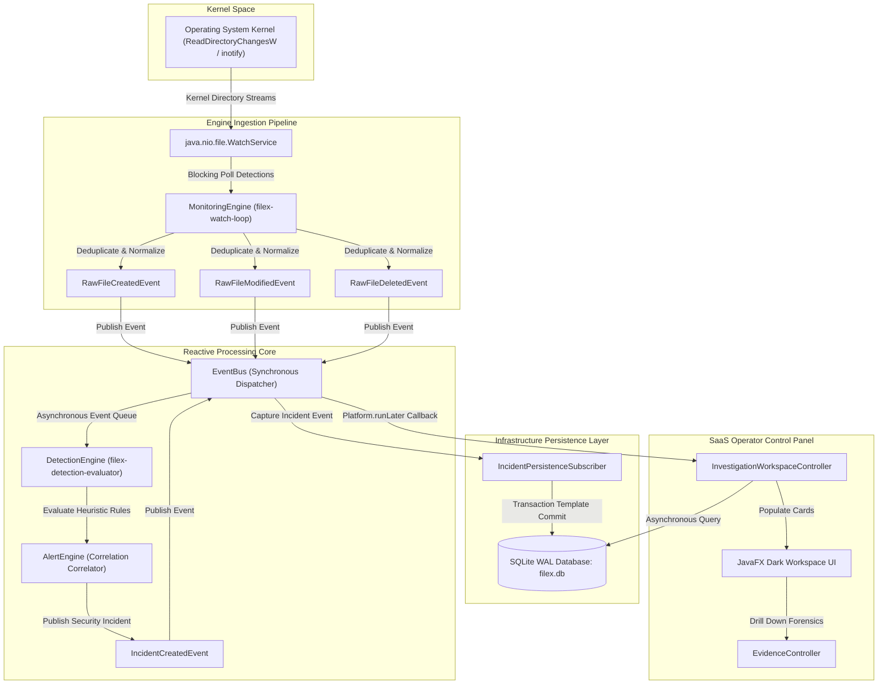
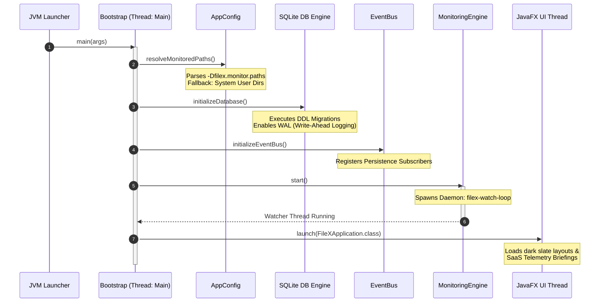
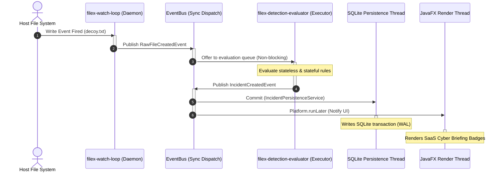
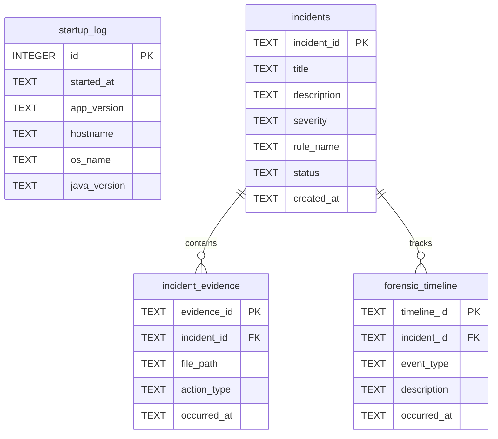

# 🏗️ FileX System Architecture Blueprint

Welcome to the comprehensive architectural design blueprint for **FileX**, a production-grade, asynchronous endpoint security agent. This document provides a deep, codebase-grounded audit of the structural patterns, telemetry pipelines, and concurrent thread boundaries designed for systems architects and security engineers.

---

## 1. High-Level System Architecture

FileX utilizes a highly decoupled, **Reactive Event-Driven Architecture (EDA)** with strict boundary separation. By rejecting global singleton anti-patterns, dependencies are explicitly composed inside `com.filex.app.AppContext` and passed via constructor injection.



---

## 2. Structural Design & Presentation Cleanliness

FileX operates under strict domain segregation to guarantee absolute component decoupling. This prevents database leakage into presentation and isolates business rules from display frameworks.

```
┌─────────────────────────────────────────────────────────────┐
│                     Presentation Layer                       │
│  (JavaFX Controllers, FXML Views, ViewManager)              │
│  Thin, purely declarative layout binders. Publishes zero    │
│  SQL queries and handles zero detection heuristics.         │
└────────────────────┬────────────────────────────────────────┘
                     │
┌────────────────────▼────────────────────────────────────────┐
│                    Application Layer                         │
│  (AppContext, Bootstrap, EventBus, Services)                │
│  The dynamic runtime orchestrator. Decouples workflows      │
│  via asynchronous multi-producer single-consumer buffers.  │
└────────────────────┬────────────────────────────────────────┘
                     │
┌────────────────────▼────────────────────────────────────────┐
│                   Infrastructure Layer                       │
│  (DatabaseManager, ConfigManager, Repositories)             │
│  OS-native WatchService bindings and SQLite WAL storage.   │
└─────────────────────────────────────────────────────────────┘
```

---

## 3. Dependency Injection and The AppContext Container

To maintain clean object lifecycles, **FileX explicitly rejects all forms of static singleton pattern abuse** (e.g. `getInstance()` methods). Instead, instances are created once by `com.filex.app.Bootstrap` and wrapped inside an immutable context container:

```java
public final class AppContext {
    private final AppConfig config;
    private final DatabaseManager databaseManager;
    private final EventBus eventBus;
    private final MonitoringEngine monitoringEngine;
    private final DetectionEngine detectionEngine;
    private final AlertEngine alertEngine;
    private final WorkspaceService workspaceService;

    // Constructor-based composing
    public AppContext(AppConfig config,
                      DatabaseManager databaseManager,
                      EventBus eventBus,
                      MonitoringEngine monitoringEngine,
                      DetectionEngine detectionEngine,
                      AlertEngine alertEngine,
                      WorkspaceService workspaceService) {
        this.config = config;
        this.databaseManager = databaseManager;
        this.eventBus = eventBus;
        this.monitoringEngine = monitoringEngine;
        this.detectionEngine = detectionEngine;
        this.alertEngine = alertEngine;
        this.workspaceService = workspaceService;
    }
}
```

This strict layout enables:
* **Frictionless Unit Testing:** Dependencies can be mocked effortlessly.
* **Deterministic Shutdowns:** Engines are torn down in precise reverse order to prevent active file descriptor leaks.
* **Config Flexibility:** The application can run concurrently in distinct isolated sandboxes without cross-polluting global variables.

---

## 4. Runtime Lifecycle & Startup Phase

FileX initializes safely through a linear, deterministic boot sequence managed by `com.filex.app.Bootstrap`. Any failures during boot isolate the system and block compromised threads from launching.



---

## 5. Telemetry Event & Alerting Pipeline

The core detection engine runs parallel rule evaluators across an asynchronous event buffer to prevent blocking native OS events.

### The Sliding-Window Stateful Rules
FileX implements stateful rule evaluation based on high-performance temporal queues:
1. **`RapidModificationRule` Heuristic:**
   * Keeps a sliding log of modification timestamps per target directory.
   * **Rule Logic:** Matches if $\ge 5$ file modifications are recorded within a $\le 2$ second sliding window. Highly effective at capturing automated ransomware processes.
2. **`MassDeletionRule` Heuristic:**
   * Keeps a sliding log of deletion events.
   * **Rule Logic:** Matches if $\ge 3$ file deletions are processed within a $\le 2$ second sliding window. Flags quick system wipes.

---

## 6. Concurrency & Threading Model

FileX enforces strict thread boundary isolation to guarantee that bulk file event surges never impact UI frames-per-second or bottleneck the OS kernel.

* **`filex-watch-loop` (Daemon Thread):** Monitors native OS directory queues in blocking-poll mode. Releases raw events to the `EventBus` within microsecond thresholds.
* **`filex-detection-evaluator` (Fixed Executor Thread Pool):** Scales parallel evaluations across multi-core processors.
* **`JavaFX Application Thread` (UI Loop):** Purely handles layout repaints, badge colors, and playbooks. All backend updates are wrapped inside `Platform.runLater()`.



---

## 7. Storage Schema & Forensics Database

All incidents are persisted inside an embedded SQLite relational archive with indexing optimized for range queries.



* **WAL Mode:** Write-Ahead Logging allows concurrently active readers (like the JavaFX Thread) to query historical alerts while the persistence service writes raw telemetry without locks or blockages.
* **Foreign Key Constraints:** Cascading deletes ensure data integrity during sandbox resets.
