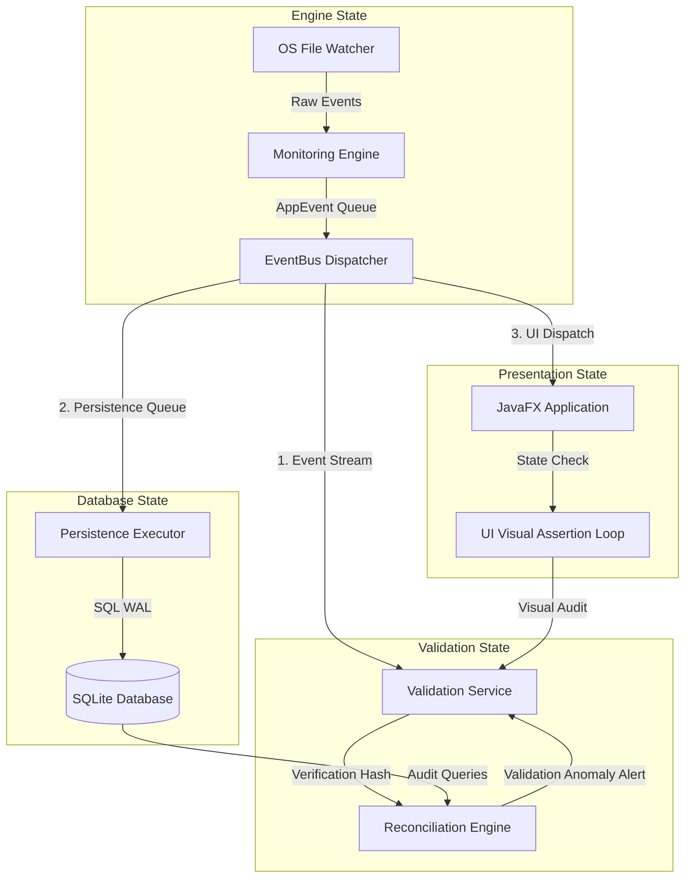

# FileX — Phase 0: Production-Grade Truth Validation Foundation
## Architectural Design & Action Plan

This document outlines the **Phase 0 Architecture** for FileX. Before developing complex endpoint detection features, we must establish a rock-solid, mathematically verifiable **Truth Validation Foundation**. This ensures that every file system event, alert, and UI state transition is deterministic, observable, thread-safe, and reconciled against a single source of truth.

---

## 🏗️ Architectural Core Principles

To build a production-grade endpoint security agent, validation cannot be an afterthought or simple counter metrics. We treat **Truth Verification** as a core system capability. The system's state must be verifiable at three distinct boundaries:
1. **Memory (Event flow and queues)**
2. **Persistence (SQLite database)**
3. **Presentation (JavaFX UI elements)**



---

## 1. Observability Gaps

### Current State Limitations
The existing `ValidationService` only counts the number of raw, detection, and incident events using `AtomicLong` counters. It is blind to **out-of-order execution, propagation latencies, dropped events,** and **processing failures**.

### Phase 0 Observability Architecture
We will introduce an explicit **Traceability Chain** and **Performance Register** directly into the event pipeline.

#### A. Structured Trace Envelope
Every `AppEvent` will inherit or encapsulate a thread-safe `EventMetadata` envelope containing:
- `traceId` (UUID): Generated at telemetry ingestion (OS Watcher level).
- `spanId` (UUID): Identifies the immediate action context.
- `parentId` (UUID): References the causal upstream event (e.g., matching a `RawFileCreatedEvent` to a `RapidModificationDetectedEvent`).
- `sequenceNumber` (long): Monotonically increasing counter per ingestion thread.
- `creationTimestampNanos` (long): Captured using `System.nanoTime()` at the boundary of the OS kernel.

#### B. Pipeline Metrics Registry
Instead of naked counters, validation will consume a structured registry tracking:
- **Queue Latency**: Delay between event publication and dispatcher thread consumption.
- **Handler Execution Duration**: In-execution elapsed time per registered subscriber.
- **Async Queue Drops**: Incremented when the bounded queue capacity is hit and events are rejected/dropped (using `tryPublishAsync` monitoring).
- **Subsystem Failures**: Counts of uncaught subscriber exceptions mapped by subscriber class name.

#### C. Validation Telemetry Ring-Buffer
For high-throughput validation without affecting the telemetry pipeline, we will build a low-overhead, in-memory circular validation buffer. This buffer records a rolling window of recent execution paths, permitting post-incident telemetry replay and path analysis in diagnostic modes.

---

## 2. Validation Reset Architecture

### Current State Limitations
Iterative manual runs, automated integration tests, and demo mode restarts leak state. There is no clean way to reset the system's internal counters or queues without stopping the JVM.

### Phase 0 State Reset Protocol
We define a highly orchestrated, transactional **Multi-Stage Reset Sequence** to guarantee a 100% clean state across runs.

```
[Active State]
       │
       ▼ (Trigger Reset)
1. Pause Ingest       ──► Suspend MonitoringEngine watcher threads.
       │
       ▼
2. Drain Queues       ──► Block until EventBus async queue size = 0.
       │
       ▼
3. Commit Persistence ──► Block until Persistence Single-Threaded Executor drains all tasks.
       │
       ▼
4. Reset State        ──► Clear caches, reset Validation AtomicLongs, wipe SQLite temp tables.
       │
       ▼
5. Memory Barrier     ──► Publish volatile-barrier 'ValidationStateResetEvent' on Sync Bus.
       │
       ▼
6. Resume Ingest      ──► Re-activate telemetry ingestion.
[Clean Ready State]
```

### Memory Barrier Integrity
The `ResetState` changes will be made using synchronized blocks or volatile reference swapping. Downstream components (repositories, engines) subscribe to `ValidationStateResetEvent` and execute their cleanup synchronously on the publishing thread before ingestion resumes.

---

## 3. Readiness Signaling

### Current State Limitations
The startup sequence in `Bootstrap` and `RuntimeManager` is purely linear and assumes instant readiness. Background thread creation, database connection handshakes, and watch key allocations are non-blocking; hence, the telemetry ingestion engine (`MonitoringEngine`) can begin pushing events before subscribers are fully registered and active, causing initial events to be silently lost.

### Phase 0 Deterministic Readiness Protocol
We implement an asynchronous readiness coordination layer:

#### A. The StatefulSubsystem Interface
Every major lifecycle component (`DatabaseManager`, `EventBus`, `DetectionEngine`, `AlertEngine`, `IncidentPersistenceSubscriber`) must implement the `StatefulSubsystem` interface:
```java
public interface StatefulSubsystem {
    /** Returns a future that completes when the subsystem is 100% operational. */
    CompletableFuture<Void> readinessLatch();
    
    /** Returns the current diagnostic status of the subsystem. */
    SubsystemStatus getStatus();
}
```

#### B. Orchestrated Readiness Barrier
1. During `Bootstrap.initialize()`, every component registers its readiness future.
2. In `RuntimeManager.start()`, a master future is created:
   ```java
   CompletableFuture<Void> allReady = CompletableFuture.allOf(
       databaseManager.readinessLatch(),
       eventBus.readinessLatch(),
       detectionEngine.readinessLatch(),
       alertEngine.readinessLatch(),
       persistenceSubscriber.readinessLatch()
   );
   ```
3. The `RuntimeManager` blocks (with a configurable timeout of 10 seconds) on `allReady.join()`.
4. Only upon successful completion of the barrier does the `RuntimeManager` trigger `activateDemoMode()` or register paths with the `MonitoringEngine`.
5. If a timeout or exception occurs, the system triggers a **Fail-Fast Shutdown** to prevent running in a partially initialized state.

---

## 4. Stale-State Contamination Risks

### Current State Limitations
Crashes or hard restarts leave residual data on the disk, in SQLite tables, or within active OS filesystem watch queues. If a new session begins, these stale artifacts are processed alongside new events, corrupting validation truth.

### Phase 0 Contamination Isolation Guard
To ensure absolute state boundaries, we define three levels of isolation:

#### A. Epoch Tracking
Every JVM launch generates an immutable `EpochId` (comprising a `UUID` + a high-resolution startup timestamp).
* **Event Guard**: Every event created contains the current `EpochId`.
* **Subsubscriber Filter**: The `EventBus` dispatcher filters out events whose `EpochId` does not match the active session. This prevents delayed async tasks from a prior execution from polluting the current session.

#### B. Pre-Flight Database Sanity Check
Before opening the database for active transactions, the `DatabaseManager` runs a mandatory sanitization script:
* Wipes temporary state tables.
* Marks any active or un-drained incidents from the previous run with a `terminated_abruptly` status flag.
* Resets SQLite sequence counters where necessary.

#### C. Idempotent Ingestion Filtering
The monitoring engine maintains an in-memory, size-bounded **Deduplication Cache** (keying on the file's normalized absolute path, event type, and kernel timestamp). If the OS watcher fires duplicate notifications or delayed events from a previous cycle, they are recognized as duplicate and discarded at the boundary.

---

## 5. Thread Safety Risks

### Current State Limitations
1. **UI Thread Crash**: Background threads in the `EventBus` (`filex-event-dispatcher`) attempt to modify UI elements, leading to JavaFX synchronization crashes or race conditions.
2. **SQLite Lock Failures**: SQLite does not support concurrent write access. If multiple background dispatcher threads attempt to write telemetry/alerts simultaneously, `sqlite-jdbc` will throw busy/locked exceptions.
3. **Validation State Corruption**: Validation metrics stored in arrays or non-atomic fields can lose updates during parallel events.

### Phase 0 Strict Thread-Boundary Model
We construct a rigid thread-containment architecture:

```
┌────────────────────────────────────────────────────────────────────────┐
│                              THREAD MODEL                              │
├──────────────────────┬────────────────────────┬────────────────────────┤
│ Thread Name / Pool   │ Responsibility         │ Execution Context      │
├──────────────────────┼────────────────────────┼────────────────────────┤
│ filex-watcher-*      │ OS WatchService Poll   │ Blocking OS IO Only.   │
│                      │                        │ No DB or UI logic.     │
├──────────────────────┼────────────────────────┼────────────────────────┤
│ filex-event-         │ Rule parsing & alert   │ In-memory processing   │
│ dispatcher-*         │ validation calculations│ only. CPU-bound.       │
├──────────────────────┼────────────────────────┼────────────────────────┤
│ filex-db-writer      │ SQLite mutations &     │ Single-threaded DB     │
│                      │ transaction processing │ queue. Eliminates locks│
├──────────────────────┼────────────────────────┼────────────────────────┤
│ JavaFX Application   │ Screen rendering & UI  │ UI updates via         │
│ Thread               │ model modifications    │ Platform.runLater()    │
└──────────────────────┴────────────────────────┴────────────────────────┘
```

#### Thread-Safety Implementation Standards
* **Database Write Isolation**: All persistence operations are routed through a dedicated `SingleThreadExecutor` inside `DatabaseManager`. No other thread is permitted to open write transactions.
* **UI Mutation Safety**: A thread-boundary utility (`FxThread.java`) will wrap all JavaFX notifications:
  ```java
  public static void runOnUi(Runnable action) {
      if (Platform.isFxApplicationThread()) {
          action.run();
      } else {
          Platform.runLater(action);
      }
  }
  ```
* **Lock-Free Validation Metrics**: All counters and timelines in `ValidationService` will use `AtomicLong` and lock-free concurrent maps (`ConcurrentSkipListMap` or `ConcurrentHashMap`) to guarantee non-blocking metric logging during event storms.

---

## 6. Persistence Truth Verification

### Current State Limitations
Even if memory event counts match, there is zero assurance that the actual database states match those numbers. Write timeouts, database lock failures, or corrupted bytes can cause divergence between memory state and persistence state.

### Phase 0 Persistence Reconciler
We design an **Out-of-Band Reconciliation Engine** to constantly audit database integrity against live events.

#### A. Cryptographic Rolling Hash (Merkle Block)
As events are validated in-memory, the `ValidationService` updates a rolling cryptographic hash:
$$\text{Current Hash} = \text{SHA-256}(\text{Previous Hash} \parallel \text{New Event Payload})$$
This forms a secure, tamper-evident log of exactly what memory observed.

#### B. Scheduled Parity Reconciliation
A low-priority daemon wakes up periodically and:
1. Queries the SQLite database for a list of processed events and their state hashes in the current epoch.
2. Re-computes the Merkle Root of the persisted records.
3. Compares the persisted Merkle Root against the active `ValidationService` Merkle Root.
4. **Action**: If a mismatch occurs, it fires a critical `PersistenceTruthAnomalyEvent`, containing the exact epoch timestamp and event index of divergence. This provides an instant early warning system for data loss.

---

## 7. UI Truth Verification

### Current State Limitations
The JavaFX UI uses cached controllers and async listeners. If the UI thread drops a frame, encounters an unhandled runtime rendering exception, or displays stale model states, the UI becomes a false visual witness of the application's actual operational state.

### Phase 0 Visual Assertion Loop
We establish a programmatic bridge to verify visual correctness:

#### A. Headless State Mirror
Every UI screen controller (e.g., Incident Workspace, Overview) must expose a thin, thread-safe state contract (`ObservableUiModel`). This model contains pure data bindings representing exactly what should be rendered.

#### B. Visual Reconciliation Loop
In validation/diagnostic mode, a background assertion manager schedules periodic checks:
1. It requests the UI controller's current visible elements (via JavaFX thread queries).
2. It cross-checks the visual element counts (e.g., number of incidents rendered in the table) directly against the `ValidationService` count.
3. If the UI lists 9 incidents but validation and database verify 10, the loop immediately flags a `UiSynchronizationAnomalyEvent` containing details of the missing item.

---

## 8. Deterministic Startup

### Current State Limitations
Non-deterministic directory mapping, varying OS disk speed, and random thread scheduling create subtle race conditions during startup. Tests become flaky, and the telemetry truth cannot be reproduced.

### Phase 0 Deterministic Bootstrap Coordinator
To enable repeatable validations, we establish strict phase gates and deterministic clocks:

#### A. Sequential Phase Gates
The application bootstrap is divided into formal, numbered gates:
* `Phase -10`: Configuration Resolution & Directory Sanitization.
* `Phase 0`: Database Schema Validation & Migration.
* `Phase 10`: Event Infrastructure (EventBus, Core Executors).
* `Phase 20`: Subsystem Ingestion & Detection Engine Warmup.
* `Phase 30`: UI Loading & View Cache Warmup.
* `Phase 40`: Telemetry Intake Ignition.

A central `LifecycleManager` coordinates these gates. Subsystems cannot transition to the next gate until all subsystems in the current gate have successfully passed self-diagnostic checks.

#### B. Deterministic Time & Replay Engines
To verify detection rules and event paths with 100% predictability:
* We introduce a `DeterministicClock` (inheriting from `java.time.Clock`) that can be frozen or advanced manually during test and validation runs.
* We support a `JournaledMockWatchService` that reads a pre-defined JSON log of file actions and injects them with microsecond precision, ensuring that race-condition anomalies are completely eliminated during truth audits.

---

## 📈 Summary of Validation Metrics & Verification Points

The following table summarizes how Phase 0 validates operational correctness at each critical boundary:

| Verification Target | Live Validation Method | Failure Condition | Recovery / Alert Protocol |
| :--- | :--- | :--- | :--- |
| **Pipeline Completeness** | Sequence number and trace ID audit on incoming vs processed events. | Gap in sequence numbers or trace correlation failure. | Raise `PipelineCorrelationAnomalyEvent` |
| **Memory Reset** | Verification of zeroed AtomicLongs and cleared queues post-reset. | Non-zero values or outstanding tasks in dispatcher thread pool. | Throw fatal `StateResetValidationException` |
| **Component Startup** | Block on joint `CompletableFuture` barrier. | Subsystem timeout or failed check during boot. | Trigger immediate fail-fast termination. |
| **State Contamination** | Epoch ID matching on all event consumption. | Event received with mismatching Epoch ID. | Drop event; log stale-state contamination warning. |
| **Thread Boundaries** | Thread-assertion checks (`Thread.currentThread().getName()`). | DB write from non-writer thread or UI update from worker thread. | Throw `ThreadViolationAssertionError` |
| **Database Integrity** | Periodic Merkle Root parity check of persisted events vs memory. | Hash mismatch or database record count divergence. | Publish `PersistenceTruthAnomalyEvent` |
| **UI Display Truth** | Headless inspection of controller data bindings. | Mismatch between UI table count and DB table count. | Raise `UiSynchronizationAnomalyEvent` |
| **Deterministic Run** | Frozen clock + Mock Watcher replay. | Telemetry sequence is non-reproducible. | Halt validation suite; report environment drift. |

---

> [!IMPORTANT]
> **Implementation Sequence Note:**
> This Phase 0 architecture lays the absolute foundation. These validators, thread boundaries, and sanitization gates will be built directly into the core project structure before any new suspicious file detection rules are written. This guarantees that all subsequent phases are verified with production-grade certainty.
