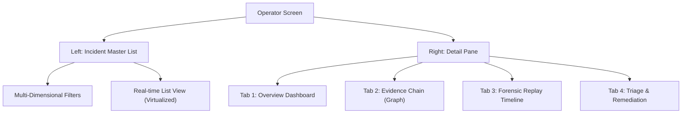
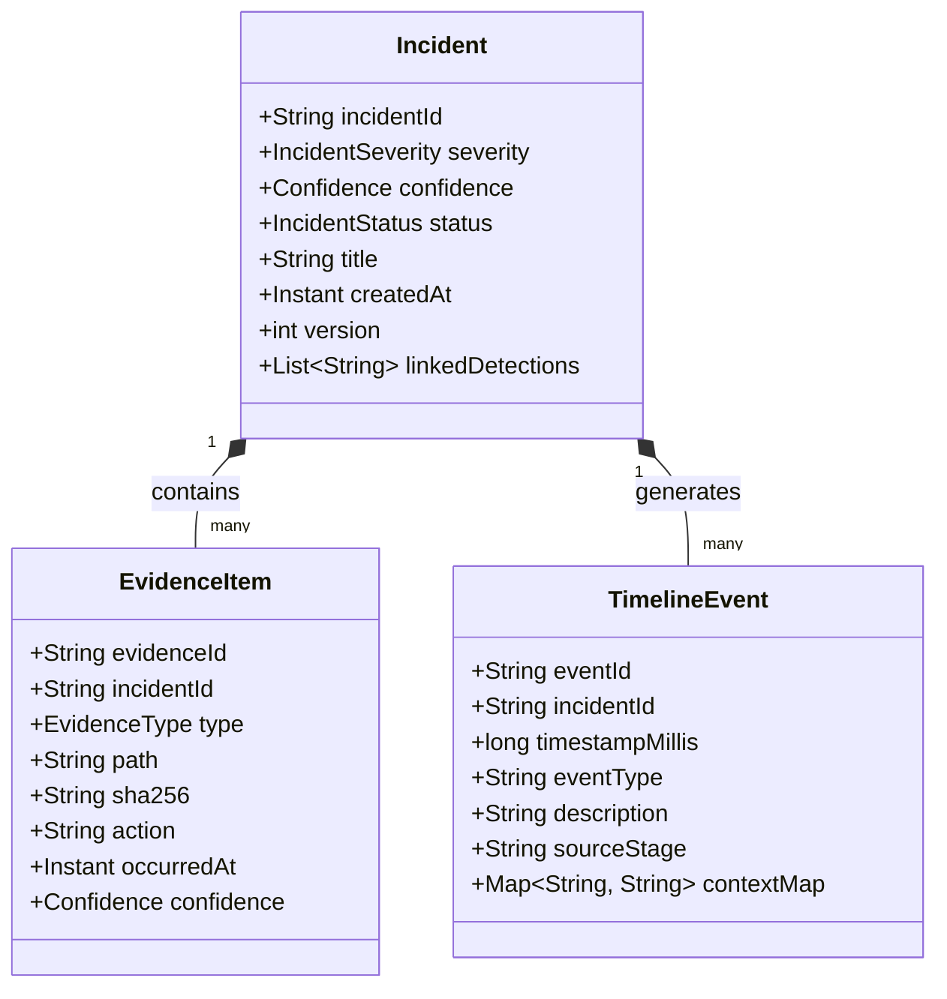
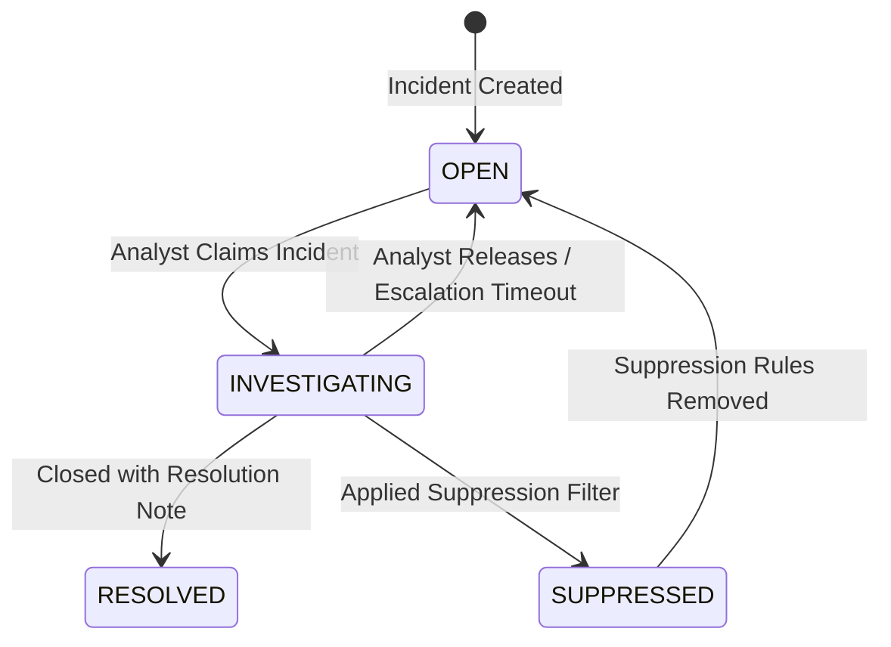

# Phase 1: Operator Investigation Workflow Architecture Plan

This document establishes the practical product architecture and technical blueprint for **Phase 1: Complete Operator Investigation Workflow**. It details the UI/UX design, detailed data models, thread-safety strategies, caching mechanisms, optimistic concurrency rules, and scalability solutions required to deliver an enterprise-ready investigation interface.

---

## 1. Dual-Pane Operator Investigation UX Flow

To support highly efficient triage and deep-dive analysis by security analysts, the **Investigation Workspace** utilizes an asymmetrical Master-Detail layout optimized for high-volume telemetry.



### UX Layout Specification
1.  **Left Pane (Master List - 35% Width):**
    *   **Search & Multi-Dimensional Filtering:** Direct string search matching files, processes, hashes, or incident IDs. Comboboxes for `Severity` (Critical, High, Medium, Low), `Status` (Open, Investigating, Resolved, Suppressed), and a date-range picker.
    *   **Virtualized ListView:** A JavaFX `ListView` utilising a custom `CellFactory` to render individual compact incident cards. Each card displays:
        *   Severity badge (color-coded).
        *   Incident Title (e.g., "Mass Deletion - HIGH").
        *   Creation timestamp, confidence indicator, and the count of linked evidence/files.
        *   Selection listener binding directly to the Right Pane's load task.
2.  **Right Pane (Detail Tabs - 65% Width):**
    *   **Tab 1: Overview:** Executive summary, severity distribution, threat confidence score, and impacted endpoints/hosts.
    *   **Tab 2: Evidence Chain:** Interactive impact tree showing the causal links from parent process -> command line arguments -> target folders -> affected files.
    *   **Tab 3: Forensic Replay Timeline:** Chronological file event stream equipped with visual media-style replay controls (Play, Pause, Step-by-Step, Speed Slider).
    *   **Tab 4: Triage & Remediation:** Action drawer containing comments section, triage category drop-down (True Positive, False Positive, Benign), and status transition controls.

---

## 2. Model Architecture

The data representation for investigation entities must be highly structured to capture complex forensic causality.



### Type Definitions
*   **`EvidenceType`**: Enum containing `[FILE, REGISTRY, PROCESS, NETWORK]`.
*   **`IncidentStatus`**: Enum containing `[OPEN, INVESTIGATING, RESOLVED, SUPPRESSED]`.

---

## 3. Evidence Chain Presentation & Causality

Visualizing the causality of an attack is critical to understanding the threat blast radius. 

### Visual Causality Graph
Instead of a simple flat list of files, the `EvidenceController` constructs a hierarchically structured tree graph (e.g., using a JavaFX `TreeTableView` or custom Canvas node graph) showing the **Impact Blast Map**:

```
[Parent Process: explorer.exe (PID: 1024)]
  └── [Spawning Process: cmd.exe (PID: 4096)]
        └── [Malicious Executable: encryptor.exe (PID: 8192)]
              ├── [Evidence Type: FILE] -> C:\Users\Alice\Documents\keys.db (DELETED)
              ├── [Evidence Type: FILE] -> C:\Users\Alice\Documents\report.docx.locked (CREATED)
              └── [Evidence Type: REGISTRY] -> HKLM\Software\Microsoft\Windows\Run\Persistence (UPDATED)
```

### High-Volume Deduplication Engine
During ransomware encryption or mass deletions, an agent can observe hundreds of thousands of individual events. To prevent rendering lag and analytical fatigue:
*   We implement an **evidence aggregation filter** in the repository/persistence subscriber.
*   Repetitive, rapid mutations (e.g., thousands of `ENTRY_MODIFY` on the same path extension in a short time window) are aggregated into a single high-value parent `EvidenceItem` containing an audit summary:
    ```json
    {
      "evidenceId": "ev-8902",
      "type": "FILE",
      "action": "MASS_MUTATION",
      "path": "C:\\Users\\Alice\\Documents\\*",
      "metadata": {
        "totalOperations": 12450,
        "affectedExtensions": [".locked", ".txt"],
        "durationMs": 4200
      }
    }
    ```

---

## 4. Forensic Timeline Reconstruction & Visual Replay

The `ReplayController` enables analysts to step chronologically through the attack sequence, answering: *"What happened first, and what was the progression?"*

### Replay Lifecycle
```
[Timeline Data Loaded] ──> [State Initialized at T=0] ──> [Play Pressed]
                                                                │
                                                                ▼
   [UI Renders Incremental Rows] <── [Step Forward T = T + 1] <─┘
```

*   **Replay Controller APIs**:
    *   `play()`: Starts an internal JavaFX `Timeline` (animation runner) that increments active time windows at a specified speed (e.g., 1s real-time = 100ms display time).
    *   `pause()`: Halts progression, preserving the current state.
    *   `stepForward()`: Advances to the next chronological `TimelineEvent`.
    *   `stepBackward()`: Reverts the last rendered event, popping it from the active display list.
    *   `seek(double progress)`: Standard slider bind, allowing absolute jumping across the event timeline.

---

## 5. Strict Incident State Transitions

To maintain operational integrity and validation-ready consistency, state transitions must follow a rigorous, transactional state machine:



### Structural Transition Rules
1.  **Gated Transitions:** You cannot move directly from `OPEN` to `RESOLVED` without an intermediate `INVESTIGATING` transition. This prevents accidental single-click closures.
2.  **Required Metadata:** Moving to `RESOLVED` requires providing a `resolutionNote` (minimum 10 characters) and a `triageCategory` (True Positive, False Positive).
3.  **Required Suppression Context:** Moving to `SUPPRESSED` requires registering an active `suppressionRule` context (e.g., target file path glob or rule name).
4.  **Transaction Enforced:** Every transition must run inside a strict SQLite transaction (`DatabaseManager.transactionTemplate()`), updating both `incidents` and inserting a tracking history record in `forensic_timeline`.

---

## 6. Query-Service Integration & Caching

The `InvestigationQueryService` provides a highly optimized, clean read interface for the UI, decoupled from raw SQL queries.

```
[UI Controllers] ──> [InvestigationQueryService] ──> [L2 Cache] ──> [SQLite DB]
```

### API Core Surface
```java
public interface InvestigationQueryService {
    List<Incident> findIncidents(IncidentQueryFilter filter, int limit, int offset);
    IncidentDetail fetchIncidentDetail(String incidentId);
    List<EvidenceItem> fetchEvidenceChain(String incidentId);
    List<TimelineEvent> fetchTimeline(String incidentId, TimelineFilter filter);
}
```

### Weak-Reference Caching Strategy
*   To support fast back-and-forth navigation between master and detail views:
    *   We introduce a **2-Level cache** inside `InvestigationQueryService`.
    *   **Level 1 (Memory-Critical Cache):** A `WeakHashMap` holding `IncidentDetail` instances. If the JVM experiences memory pressure, Java GC automatically reclaims cached UI models.
    *   **Level 2 (Invalidation Policy):** Whenever an incident undergoes a state transition, an update notification is received from the `EventBus` which immediately purges the corresponding cache entry.

---

## 7. UI-Backend Thread Safety Model

Heavy database joins, timeline event sorting, and process graph assemblies **MUST NOT** be executed on the UI rendering thread. If the JavaFX Application Thread blocks for more than **16.6ms** (60Hz), the UI will freeze.

```
 [JavaFX Thread]                      [Investigation Worker Pool]
        │                                         │
        ├──> [Submit Query Task Async] ──────────>┤
        │                                         ├──> [Executes SQL Joins]
        │                                         ├──> [Generates Causality Graph]
        │<── [Callback via Platform.runLater()] ──┤
        ▼                                         ▼
```

### Safe Bridge Pattern
We use `javafx.concurrent.Task<V>` and `javafx.concurrent.Service<V>` combined with named thread pools:
1.  **Background Thread Pool:** All query and analysis operations run on a shared, daemon worker pool `filex-investigation-worker` (max 4 threads to prevent CPU thrashing).
2.  **UI Updates Gated:** Background workers NEVER touch FXML components or modify active observable lists directly. They return results, which are bridged back to the UI thread using `Platform.runLater()`.

```java
// Production-grade async fetch wrapper
public void loadIncidentDetail(String incidentId) {
    Task<IncidentDetail> fetchTask = new Task<>() {
        @Override
        protected IncidentDetail call() throws Exception {
            // Executed strictly in the background
            return queryService.fetchIncidentDetail(incidentId);
        }
    };

    fetchTask.setOnSucceeded(event -> {
        // Executed strictly on the JavaFX Application Thread
        IncidentDetail detail = fetchTask.getValue();
        updateDetailPaneUI(detail);
    });

    fetchTask.setOnFailed(event -> {
        log.error("Failed to load incident: {}", fetchTask.getException().getMessage());
        showErrorBanner(fetchTask.getException());
    });

    investigationThreadPool.submit(fetchTask);
}
```

---

## 8. Stale UI Data Risks & Remediation

In a production endpoint security center, multiple analysts triage incidents concurrently. This leads to **Stale State Contamination Risks**:
*   *Scenario:* Analyst A opens Incident #102. Analyst B opens the same incident concurrently. Analyst A resolves it. Analyst B, viewing a stale "OPEN" screen, attempts to resolve it with a different resolution note, overwriting Analyst A's action.

### Remediation Strategies
1.  **Optimistic Concurrency Control (OCC):**
    The `incidents` schema carries a `version INTEGER` column. Every state transition SQL statement verifies the version:
    ```sql
    UPDATE incidents 
    SET status = ?, version = version + 1 
    WHERE incident_id = ? AND version = ?;
    ```
    If rows updated == 0, a `ConcurrentModificationException` is thrown, and the UI displays a warning banner forcing a refresh.
2.  **Real-Time Active Invalidation:**
    The UI controllers subscribe to `IncidentUpdatedEvent` via the `EventBus`. If a background update event carries the ID of the incident currently displayed in the analyst's detail pane, the UI immediately displays an *"Incident has been modified by another operator. Click to Refresh"* overlay, lock-protecting inputs.

---

## 9. UI Scalability & High-Volume Telemetry

Security agents must be resilient to event storms (e.g., ransomware generating 100,000 file creations in 10 seconds).

### Engineering Safeguards
1.  **Cell Virtualization:**
    Instead of adding FXML node graphs to a `VBox` (which instantiates and renders all elements, causing out-of-memory crashes), we enforce strict cell virtualization via JavaFX `ListView` or `TableView`. This keeps the active DOM size locked to only the visible rows (typically 20-30 cards).
2.  **Database Pagination & Windowing:**
    The master list query uses strict pagination bounds:
    ```sql
    SELECT * FROM incidents 
    ORDER BY created_at DESC 
    LIMIT :limit OFFSET :offset;
    ```
    Infinite scrolling triggers new async database reads as the analyst scrolls past the 80% mark of the virtualized list view.
3.  **Timeline Pre-Aggregation:**
    Timeline lists are limited to a maximum of 500 displayable chronological events. High-frequency repetitive filesystem events are grouped into aggregated timeline packets (e.g. *"99+ file modifications registered in C:\Temp"*), which expand into popups only when clicked, saving precious UI cycles.
